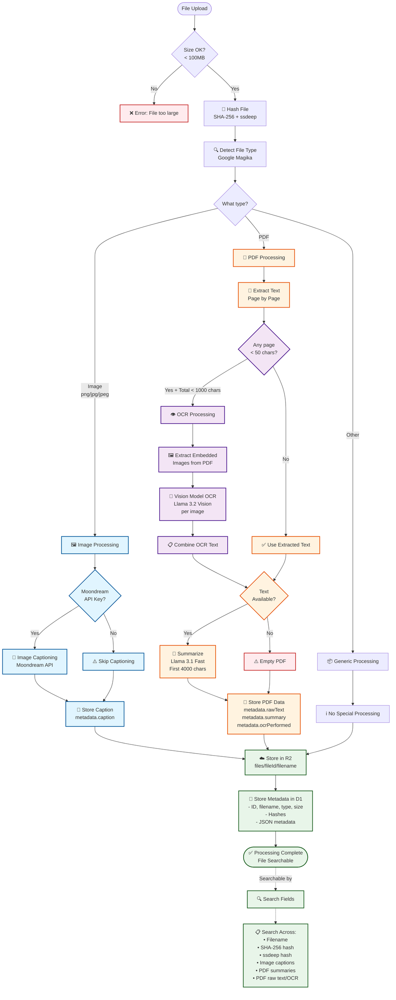

# SkyDrive Architecture

## File Processing Flow

This document describes how different file types are processed when uploaded to SkyDrive.

## Supported File Types

### 1. Images (PNG, JPG, JPEG)
- **Detection**: Google Magika file type detection
- **Processing**:
  - Image captioning via Moondream API (if `MOONDREAM_API_KEY` is set)
  - Generates natural language description of image content
- **Storage**:
  - Original image → R2
  - Caption → `metadata.caption` in D1
- **Searchable**: Filename, hashes, caption text

### 2. PDFs
- **Detection**: Google Magika file type detection
- **Text Extraction**: Page-by-page text extraction using `unpdf`
- **OCR Trigger**: Automatic OCR if any page has < 50 characters AND total text < 1000 chars
- **OCR Method**:
  1. Extract embedded images from PDF using `pdf-lib`
  2. Run Llama 3.2 Vision model on each image
  3. Combine OCR'd text from all images
- **Summarization**: First 4000 chars sent to Llama 3.1 Fast for summary
- **Storage**:
  - Original PDF → R2
  - Text/OCR → `metadata.rawText` (first 50k chars)
  - Summary → `metadata.summary`
  - OCR flag → `metadata.ocrPerformed`
- **Searchable**: Filename, hashes, raw text, summary

### 3. All Other Files
- **Detection**: Google Magika file type detection
- **Processing**: Hashing only (SHA-256 + ssdeep)
- **Storage**:
  - Original file → R2
  - Basic metadata → D1
- **Searchable**: Filename, hashes

## Processing Steps

### Step 1: File Validation
- Max size: 100 MB
- Must not be empty (0 bytes)

### Step 2: Hashing
- **SHA-256**: Cryptographic hash for exact file matching
- **ssdeep**: Fuzzy hash for similarity detection

### Step 3: File Type Detection
- Uses Google Magika ML model for accurate type detection
- Handles files with missing or incorrect extensions

### Step 4: Content Processing
- **Images**: Captioning with Moondream
- **PDFs**: Text extraction → OCR (if needed) → Summarization
- **Other**: No content processing

### Step 5: Storage
- **R2**: File stored at `files/{fileId}/{filename}`
- **D1**: Metadata stored in `files` table with JSON metadata column

## Technology Stack

### Cloudflare Services
- **Workers**: Serverless compute
- **Workflows**: Multi-step processing with retries
- **R2**: Object storage
- **D1**: SQL database
- **Workers AI**:
  - Llama 3.2 Vision (11B) - Image OCR
  - Llama 3.1 Fast (8B) - Text summarization

### External Services
- **Moondream API**: Image captioning (optional)

### Libraries
- **Magika**: File type detection
- **ssdeep.js**: Fuzzy hashing
- **unpdf**: PDF text extraction
- **pdf-lib**: PDF image extraction

## Search Capabilities

Search queries match across:
1. Filename (partial match)
2. SHA-256 hash (exact match)
3. ssdeep hash (exact match)
4. Image captions (partial match)
5. PDF summaries (partial match)
6. PDF raw text/OCR (partial match)

Results limited to 50 files, sorted by newest first.

## Admin Features

The admin dashboard (`/admin`) provides:
- View all uploaded files
- Multi-select file deletion
- Delete from both R2 and D1
- Detailed error messages for failed operations
- Statistics (total files, total storage)

## Cost Monitoring

**OCR Costs**: When OCR is triggered:
- 1 vision model inference per embedded image in PDF
- For a 100-page scanned PDF with 1 image per page = 100 inferences
- Monitor costs in Cloudflare dashboard under Workers AI usage
